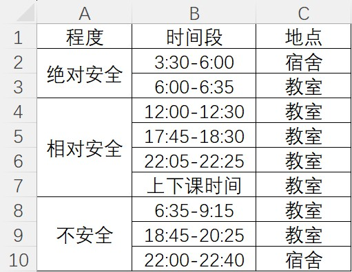
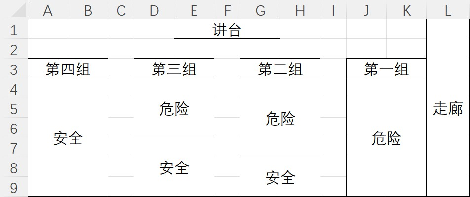

# 项目第一阶段规划

## 阶段总览

项目目前位于阶段一：中共国高中至专科前。

## 高二下学期

目前，学校所教内容与本人项目未来的考试要求严重冲突，为了解决这个问题，本人决定将原居家上网课自习的手段带到学校，以减轻项目未来的运行负担。

根据该衡水式高中目前的作息时间表，制定以下行动计划：

### 在校电子产品藏匿手段

> 注意：这些手段并没有考虑到查监控等针对性的情况，因为该衡水式高中目前还未动用如此大的人力物力进行大规模突击检查，某些情况下可能需要本人随机应变处理。

1. 在周日携带电子设备进入校园时，采用分散投放的方式，将各个指定的电子产品分别投放到各个指定的位置。待夜修结束（22:00）后再回到各个电子产品所在的位置，拿取电子产品。
2. 在第二天早上6:35完成早上的自习后，将各个指定的电子产品再次分别投放到各个指定的位置。待第二节课下课10分钟后，再回到各个电子产品所在的位置，拿取电子产品。
3. 可使用学校电源对电子设备进行充电（尽量使用走班课室电源），具体时间为：
   - 走班课/体育课期间
   - 中午、下午放学期间
   - 夜修结束后的22:25到第二天早上
4. 在周五放学的最后一节课前，将各个电子产品集中放置到本班教室的隐藏收纳处，等待放学后取走所有的电子产品。

### 在校电子产品使用规范

第二天6:00从宿舍回班后，即可开始一天的自习。

可安全使用电子产品的时间范围：

* 绝对安全：可在任意室内的任何范围内使用任何电子产品。
* 相对安全：根据教室所坐座位决定是否可使用智能手机大小的电子产品。
* 不安全：不得使用任何电子产品，并将电子产品按程序分布藏匿。

教室危险程度分布图：

* 安全区域：可在相对安全-绝对安全期间使用任何电子产品（视情况而定）。

* 危险区域：严禁在不安全-相对安全期间使用任何电子产品。

### 在校作息规律

1. 知识整理方面请在早上6:00进行。
2. 游戏代肝方面请在中午12:00、晚上22:00进行。
3. 背诵单词方面请在下午5:45进行。

因为要早上6:00到达教室自习，为了最大化利用这段时间：

- 自己带早餐在前往课室的途中进食。
- 宿舍值日请在6:25停止自习，完成电子设备藏匿后前往宿舍值日。

## 高三上学期

考虑到高三时期学校几乎已把所有的空余时间排满，已经很难再像高二那样拥有大把的自主学习时间用于学习与本人目标相匹配的内容。

因此，根据优先级，本人应尽量争取：

1. 完全回家自学
2. 多请假回家自学
3. 不回家半自学

如果能争取到完全回家自学，具体学习计划参见本文档“高中学业考至专科阶段”一节。

如果不能争取到完全回家自学，请结合“多请假回家自学”和“不回家半自学”交替进行。

接下来根据以上优先级给出具体的谈判方案。

### 完全回家自学

与老师谈判过程中需要提到的要点：

1. 与大部分同学没有利益冲突

   本人下一个小目标是进入专科院校，因此与同学们的夏季高考目标无直接联系。

2. 高三阶段自主学习时间已不如高二

   在高三阶段，学校几乎已把所有的空余时间排满，已经很难再像高二那样拥有大把的自主学习时间用于学习与本人目标相匹配的内容，因此请求老师在课堂上能够在课堂和作业上给我一些时间和空间。接着抛出进度，在高二阶段本人已经利用了大把在学校的自主学习时间用于学习与本人目标相匹配的内容，可将学习成果向老师展示，以得到老师对本人自学成果的肯定。

3. 本人在高二为未来目标的努力

   本人未来的总目标是移民美国，下一阶段的目标是考日本的大学，在中共国上专科院校的阶段为积累知识攒钱的过渡阶段。也就是说，上专科院校的时间是过渡用的，本人的知识水平和经济实力如果达到润去中转站（日本）的条件，会立刻放弃在中共国的专科学历，润去日本考大学，为未来移民美国的目标作中转准备。

4. 发出免责声明

   “老师，有一点你可以放心，我都已经成年了，回家自学是我自己的选择，所以无论发生什么我都一定会全权为自己的选择负责的。并且来跟老师沟通之前我也已经和父母们深入沟通过并取得了他们的理解和支持，如果还能得到老师的支持我会非常感激。”

带家长与老师谈判过程中需要提到的要点：

1. 本人必须与家长一起和老师谈判。
2. 由家长携带本人用于学习的电子产品，以便向老师展示本人目前的自学成果。
3. 多提及本人早已是成年人，具有承担完全责任人的能力。

### 多请假回家自学

钻学校校医室的漏洞，请病假，病历参考以下模板：

广州市番禺区第六人民医院

门（急）诊病历

微信支付

---

就诊时间： 2023年11月16日10时47分        就诊科室： 内科
姓名： XXX    性别： 男    年龄： 18岁    门诊号：1001320231

---

主诉：患者主诉出现腹泻症状，起因为食用辛辣食物，持续时间约12小时。
病史：无过敏史。无慢性疾病史。
体格检查：T：36.6℃，BP：110/80mmHg，R：21次/分，P：75次/分血糖：空腹：，餐后mmol/l  腹部软，压痛明显，尤其在左下腹部，肠鸣音正常，无腹块、包块触及
辅助检查：白细胞计数正常，大便隐血试验阴性
诊断：急性腹泻，可能由于辛辣食物引起的肠道炎症。
处理：1、【国光】地兰诺酯（国）  10.0mg  口服  每日一次  x2天  总量2片  2、忌口辛辣、刺激性食物，以免加重症状  3、观察病情，如持续腹泻或出现其他不适症状，及时就医
嘱托：预约1天后复诊。

---

医生：XXX      签名：                     打印时间：2023-11-16 11:12:23

病历伪造说明：

1. 使用ChatGPT生成病历内容。
2. 修改就诊时间和打印时间。（注意打印时间要在就诊时间后）
3. 打印后使用切纸机裁剪至A5大小。
4. 贴在病历本上拍照发给老师。

### 不回家半自学

本人需要在课堂上拥有自学的特权，因此需要先和科任老师谈判。谈判过程中注意以下几点，谈判成功的概率将大大增加：

1. 不要不好意思更不要觉得理亏

   自学是你对自己的未来做出的谨慎选择，你没有任何错也不应该被任何人指责。所以你应该理直气壮地找老师并且心平气和地谈判沟通。

2. 不要指责老师而是反思自己

   不要直接说“老师你讲课很差…”之类的话。谈判过程应主动全程反思并贬低自己，并在表现出不服输的倔强后缓慢提出“课堂自学”的真实想法。

   对于已经考完学考的科目，直接声明本人参加的是春季高考。

   对于还未考完学考的科目（语文、数学、英语），提及本人未来的总目标。

3. 发出免责声明

   “老师，有一点你可以放心，我都已经成年了，部分脱离进度是我自己的选择，所以无论发生什么我都一定会全权为自己的选择负责的。并且来跟老师沟通之前我也已经和父母们深入沟通过并取得了他们的理解和支持，如果还能得到老师的支持我会非常感激。”

4. 谈判要有进有退

   “老师你放心，虽然以后我在课堂上可能会完成一些自己的学习安排，但我会做出以下保证：我需要静心学习，因此不会去扰乱课堂的秩序；我的目标也不是大部分同学所参加的夏季高考，因此与大部分同学没有竞争关系，我不会也没有必要去影响其他同学的正常学习。”

5. 生米煮成熟饭

   在谈判的最后我应拿出为未来目标做好的学习规划（最好是写在纸上甚至是打印好的文件）摆在老师桌上，然后说：

   “感谢老师的理解，这个呢算是我针对我未来的目标制定的一个学习计划，但可能由于自己经验不够丰富所以还有疏漏，想请老师再给我提一些建议…（例如英语老师给出考托福的建议）”

   然后我就开始指着你的计划给老师讲解，一边讲还要一边问老师：

   “老师你觉得这个地方合理吗？是不是需要修改呀？你还有没有什么更好的建议呢？”

   最后，如果我还想为自己和老师的谈判加上一个保险，你还可以在谈话临近结束时加上一个“话引子”——

   “谢谢老师给我的宝贵建议，我会好好参考并修订自己的计划的！那以后在过程中如果我对学科或者规划有了新问题还可以来咨询老师吗？”

## 高中学业考至专科前

本阶段为完全回家自学，要达成的目标如下：

1. 上B站学习数学、物理、化学的基础课程，以后再使用日语进行转换。
1. 背日语单词和英语单词，着重背日语单词，为下一阶段提供语言学习基础。
1. 学习如何投资加密货币，尽最大可能让钱生钱。

---

数理化方面：

* B站一数《高中数学基础全集》
* B站一化儿《高中化学基础与解法全集》
* B站物理云学习逸迭Eddie《高中物理免费系统复习课》

请使用iPad结合Apple Pencil在笔记软件“Prodrafts”上记录笔记。

---

语言方面：

英语单词背诵请使用iPad结合Apple Pencil在软件“不背单词”上进行背诵。

日语单词方面请结合书籍《新版标准日本语》使用iPad结合Apple Pencil在记忆卡片软件“WinkNotes”上进行单词记忆。

---

投资方面：

使用币安（Binance）交易所交易加密货币。

比特币（BTC）和以太坊（ETF）是排名前二的加密货币，及其推荐投资。

---

作息时间如下：

> 注意：前往图书馆自学或者居家自学应交替进行。

### 图书馆自学

| 时间  | 事件       |
| ----- | ---------- |
| 8:00  | 通勤       |
| 9:10  | 到达图书馆 |
| 12:10 | 午餐       |
| 12:30 | 午休       |
| 14:00 | 早返家     |
| 17:30 | 晚返家     |

前往图书馆学习注意：

* 前一天必须有充足的睡眠，以确保精力充沛。
* 下雨天居家自学。

### 居家自学

| 时间  | 事件 |
| ----- | ---- |
| 6:00  | 起床 |
| 22:30 | 睡觉 |

居家自学注意：

* 早上理科，晚上文科
