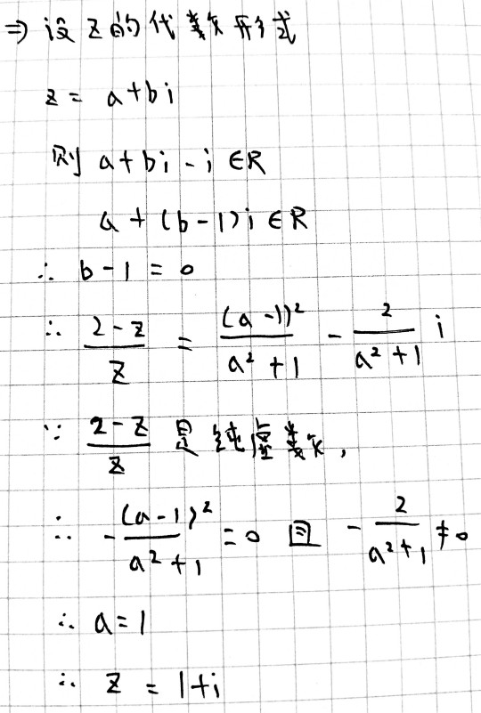
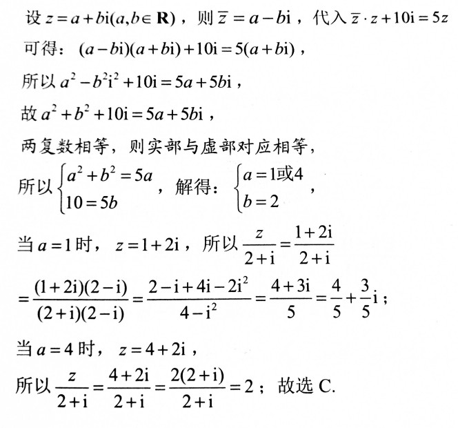
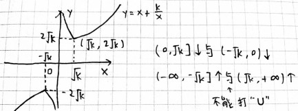
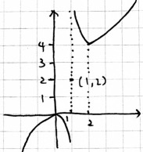
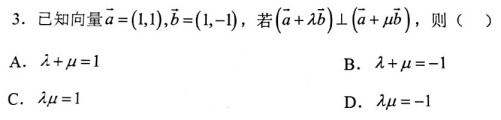

当前所在位置：<strong>run > 高中 > 数学</strong>

# 函数概念

描述x与y之间的依赖关系

$f(x)=x^2,x\in[1,3]$

* 值域：因变量f(x)的取值集合
* 定义域：自变量x的取值集合
* 对应关系：每个x都与唯一的y相对应

---

对应关系考点：判断函数是否相等

**对应关系**和**定义域**都要相等，二者缺一不可
$$
\begin{cases}
f(x)=x,x\in R \\
\neq \\
f(x)=\frac{x^2}{x},x\in (-\infty,0)\cup(0,+\infty)
\end{cases}
$$

---

定义域考点：

$$
\begin{cases}
\frac{1}{a},a\neq 0 \\
\sqrt{a},a\geq 0 \\
\log_a b,(a,b>0),a\neq 1 \\
x^0,x\neq 0
\end{cases}
$$

---

值域考点：求值域

## 值域常见求法

**一次分式**：将分母整体换元

$y=\frac{5x-1}{4x+2},x\in [-3,-1]$

令t=4x+2，

$$
\therefore\begin{cases}
x=\frac{t-2}{4} \\
t\in[-10,-2]
\end{cases}
$$

$$
\therefore y=\frac{5\cdot(\frac{t-2}{4})-1}{t}=\frac{\frac{5}{4}t-\frac{7}{2}}{t}=\frac{5}{4}-\frac{\frac{7}{2}}{t}\in[\frac{8}{5},3]
$$

**二次分式**：移项

$y=\frac{2x^2+4x-7}{x^2+2x+3}$

$yx^2+2yx+3y=2x^2+4x-7$

将等号右边的式子移过来，得 $(y-2)x^2+(2y-4)x+3y+7=0$

x是一定存在的，所以Δ≥0（前提y-2≠0），所以从Δ得出的y的范围就是值域

1. y-2≠0， $\Delta=0\geq 4(y-2)(2y+9)$ 

   （y-2的零点是2，2y+9的零点是 $-\frac{9}{2}$ ，y≠2）

    $\therefore -\frac{9}{2}\leq y<2$

2. y-2=0， $0\cdot x^2+0\cdot x+13=0$ ，所以无解

$\therefore y\in [-\frac{9}{2},2)$

**同次根号**：根号里次数和根号外次数相同，使用整体换元法

$y=2x+\sqrt{1-2x}$ ，设 $t=\sqrt{1-2x}$

$\therefore x=\frac{1-t^2}{2}$

$y=1-t^2+t=-(t-\frac{1}{2})^2+\frac{5}{4}\in(-\infty,\frac{5}{4}]$

## 函数的单调性与最值

单调性：对于f(x)定义域I内某个区间D上任意两个自变量x₁、x₂，当x₁<x₂时：

* 若f(x₁)<f(x₂)，则f(x)在D是增函数
* 若f(x₁)>f(x₂)，则f(x)在D是减函数

最大值：f(x)定义域I,若存在实数M，使得：

1. x∈I，f(x) ≤/≥ M（确保始终处于顶点）
2. 存在x₀∈I，使f(x₀)=M（确保M在函数上）

例题： $f(x)=\frac{2x^2}{x-1}$ 在(0,1)上的单调性？

解：任设0<x₁<x₂<1，则有 $f(x_1)-f(x_2)=\frac{2x_1^2}{x_1 -1}-\frac{2x_2^2}{x_2-1}=\frac{2x_1^2(x_2-1)-2x^2_2(x_1-1)\Longrightarrow >0}{(x_1-1)(x_2-1)\Longrightarrow >0}$

$\therefore f(x_1)>f(x_2),\therefore f(x)$ 在(0,1)上单调递减

## 函数的奇偶性

偶函数：对定义域I内任一x，都有f(x)=f(-x)，称f(x)为偶函数

例：f(x)=x²，f(3)=f(-3)

---

奇函数：对定义域I内任一x，都有f(x)=-f(-x)，称f(x)为奇函数

例：f(x)=x³、 $f(x)=\frac{1}{x}$

---

**定义域包含0，是奇函数，一定过原点**

f(x)=-f(-x)，令x>0，有f(0)=-f(-0)=-f(0)

$\therefore 2f(0)=0,\therefore f(0)=0$

## 对勾/双勾函数的性质

$y=x+\frac{k}{x}(k>0)$

---

求函数 $f(x)=x+\frac{x}{x-1}$ 的单调区间及对称中心

解： $f(x)=x+\frac{x-1+1}{x-1}=x+\frac{1}{x-1}+1=x-1+\frac{1}{x-1}+2$

设 $g(x)=x+\frac{1}{x}$ *向右平移1>* $x-1+\frac{1}{x-1}$ *向上平移2>* $x-1+\frac{1}{x-1}+2$

**左加右减自变量，上加下减常数项**

---

求函数 $f(x)=x+\frac{1}{2x-4}$ 在 $(2,+\infty)$ 上的最低点坐标（换元法示例）

解： $f(x)=x+\frac{\frac{1}{2}}{x-2}$

令x-2=t>0，得 $t+\frac{\frac{1}{2}}{t}+2$

$\therefore t=\sqrt{\frac{1}{2}}=\frac{\sqrt{2}}{2}$ 时， $y=f(x)_\min =\sqrt{2}+2$

$\therefore x=t+2=\frac{\sqrt{2}}{2}+2$

$\therefore(2+\frac{\sqrt{2}}{2},2+\sqrt{2})$

---

求函数 $y=\frac{x^2+5}{\sqrt{x^2+4}}$ 的最小值

解：令 $\sqrt{x^2+4}=t,\therefore x^2+4=t^2$

$y=\frac{t^2+1}{t}=t+\frac{1}{t}(t\geq 2)$

$(\because x^2\geq 0,\therefore \sqrt{x^2+4}\geq 4,\therefore t\geq 2)$

∴t=2时， $y_\min=2+\frac{1}{2}=\frac{5}{2}$