

当前所在位置：<strong>run > 高中 > 数学</strong>

# 初等函数

**指数与指数幂的运算法则**：

* $a^r\cdot a^s=a^{r+s}$
* $(a^r)^s=a^{rs}$
* $(a\times b)^r=a^r\cdot b^r$

---

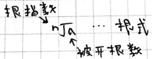

* 平方根： $x^2=a$ ， $(\pm 3)^2=9,\pm 3$ 是9的平方根
  * 算术平方根： $\sqrt{9}=3$ ， $-\sqrt{9}=-3$
* 立方根： $x^3=a$ ， $(-2)^3=-8$ ，-2是-8的立方根
* n次方根： $x^n=a$ ， $(\pm 2)^4=16$ ， $(-2)^5=32$ ， $-2=\sqrt[5]{32}$
  * n为奇数： $x=\sqrt[n]{a}$
  * n为偶数： $x=\pm\sqrt[n]{a}$

---

**分数幂**：

* 规定 $a^{\frac{m}{n}}=\sqrt[n]{a^m}(a>0,n,m\in N^*,n>1)$
  * 当m=1时， $a^{\frac{1}{n}}=\sqrt[n]{a},\sqrt{a}=a^{\frac{1}{2}},\sqrt[3]{a}=a^{\frac{1}{3}}$
* 规定 $a^{-\frac{m}{n}}=\frac{1}{a^{\frac{m}{n}}}(a>0,n,m\in N^*,n>1)$

---

**分数指数幂运算**：

有未知数：

$\sqrt{a\cdot\sqrt[3]{a}}=(a^1\cdot a^{\frac{1}{3}})^{\frac{1}{2}}=(a^{1+\frac{1}{3}})^{\frac{1}{2}}=(a^\frac{4}{3})^\frac{1}{2}=a^{\frac{4}{3}\times\frac{1}{2}}=a^\frac{2}{3}$

无未知数：

$(2\frac{3}{5})^0+2^{-2}\times(2\frac{1}{4})^{-\frac{1}{2}}-(0.01)^{\frac{1}{2}}$

$=1+\frac{1}{2^2}\times\frac{1}{\sqrt{\frac{9}{4}}}-\sqrt{\frac{1}{100}}$

$=1+\frac{1}{4}\times\frac{2}{3}-\frac{1}{10}$

$=1+\frac{1}{6}-\frac{1}{10}$

$=\frac{16}{15}$

## 幂函数

$y=x^\alpha$

例： $y=x^3,y=x^{-1}$ ，其他形如 $y=2x^2$ 的不是幂函数！

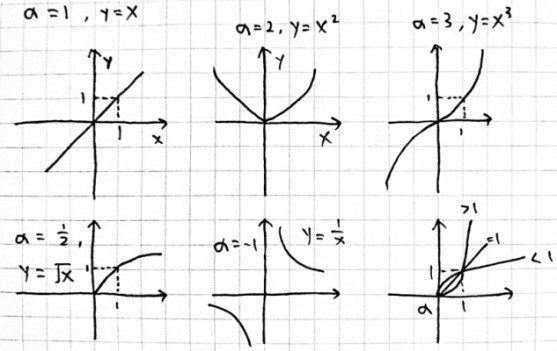

常见的α有 $1,2,3,\frac{1}{2},-1$

## 指数函数

$y=a^x(a>0,a\neq 1)$

例： $y=3^x,y=-1^x$ ，其他形如 $y=2^x+2$ 的不是指数函数！

所有指数函数都过(0,1)点

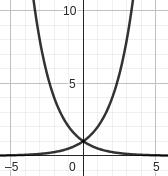

1. a>1，例： $y=2^x$
2. 0<a<1，例： $y=(\frac{1}{2})^x=(2^{-1})^x=2^{-x}$

---

指数函数/幂函数大小比较：画图

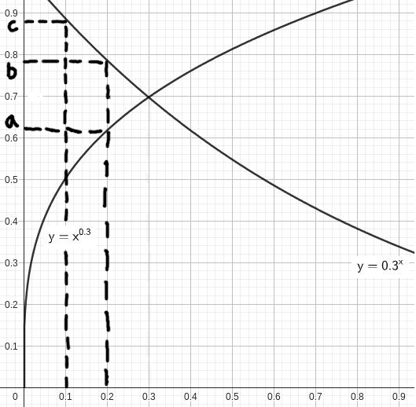

* $a=(0.2)^{0.3}$
* $b=(0.3)^{0.2}$
* $c=(\frac{10}3{})^{-0.1}=(0.3)^{0.1}$

---

若函数 $f(x)=(k+3)a^x+3-b(a>0,a\neq 1)$ 是指数函数，

(1)求k,b的值；(2)求解不等式 $f(2x-7)>f(4x-3)$

解：(1)∵指数函数

$$
\therefore\begin{cases}
k+3=1 \\
3-b=0
\end{cases},\therefore
\begin{cases}
k=-2 \\
b=3
\end{cases}
$$

(2) $\because y=a^x$ ， $\therefore f(2x-7)=a^{2x-7}>f(4x-3)=a^{4x-3}$

* a>1，即2x-7>4x-3即可，∴x<-2

  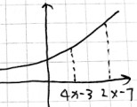

* 0<a<1，即4x-3>2x-7即可，∴x>-2

  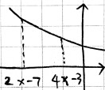

综上，在a>1时，{x|x<-2}；在0<a<1时，(-2,+∞)

## 对数定义

$a^x=N(a>0,a\neq 1)$

完全等价于 $x=\log_aN$ （a为底数，N为真数）

例： $\log_x 8=6\Longleftrightarrow x^6=8,\therefore x=\sqrt[6]{8}=2^\frac{3}{6}=2^\frac{1}{2}=\sqrt{2}$

---

常用对数：（注：e=2.71828，a>0且a≠1）

1. 对数10简写： $\log_{10}N=\lg N$ ， $\lg 100=\log_{10}100=2$
2. 自然对数简写： $\log_e N=\ln N$ ， $-\ln e^2=x\Rightarrow \log_e e^2=-x,e^{-x}=e^2,x=-2$
3. $a^{\log_a x}=x$ ， $3^{\log_3 15}=15$

## 对数运算法则

令 $M=a^m$ ，则 $m=\log_a M$

令 $N=a^n$ ，则 $n=\log_a N$

$\therefore a^{m+n}=a^m\cdot a^n=M\cdot N$

$\therefore m+n=\log_a MN$

结论：

1. $\log_a M+\log_a N=\log_a(MN)$
2. $\log_a M-\log_a N=\log_a(\frac{M}{N})$
3. $\log_a b^x=x\log_a b$

例： $\lg^\sqrt[5]{100}=\lg 100^\frac{1}{5}=\frac{1}{5}\lg 100=\frac{1}{5}\times 2=\frac{2}{5}$

## 换底公式

$\log_a b=x\Leftrightarrow a^x=b(c>0,c\neq 1)$

$\log_c a^x=\log_c b$

$x\log_c a=\log_c b$

$\therefore x=\frac{\log_c b}{\log_c a}=\log_a b(a\neq 1,a>0)$

例：证 $\log_a b\cdot\log_b c\cdot\log_c a=1$

$\log_a b\cdot\frac{\log_a c}{\log_a b}\cdot\frac{\log_a a}{\log_a c}=1$

---

令c=b，则 $\frac{1}{\log_b a}=\log_a b$

例： $\log_2 8=\frac{1}{\log_8 2}$ ， $\log_4 8=\frac{\log_2 8}{\log_2 4}=\frac{3}{2}$

---

$\log_{a^x}b^y=y\log_{a^x}b=y\cdot\frac{1}{\log_b a^x}=\frac{y}{x}\cdot\log_a b$

例： $\log_4 8=\log_{2^2}2^3=\frac{3}{2}\log_2 2=\frac{3}{2}$

## 对数函数

$y=\log_a x(a>0,a\neq 1,x>0)$

例： $y=\log_3 x$ ，其他形如 $y=2\log_3 x+1$ 的不是对数函数！

* a>1时， $y=\log_2 x$ ， $2^y=x$

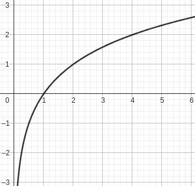

* a<1时， $y=\log_\frac{1}{2} x$ ， $(\frac{1}{2})^y=x$

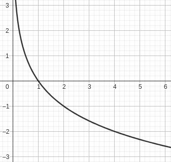

---

考点：求定义域

$\because\log_3 (4-x)$ ， $\therefore 4-x>0$ ， $\therefore x<4$

---

例1：若函数 $y=\log_2(kx^2+4kx+5)$ 的定义域为R，则k的取值范围为？

函数定义域为R，意味着 $kx^2+4kx+5>0$ 恒成立

1. k=0时，5>0，恒成立
2. k≠0时， $0 < k < \frac{5}{4}$

$$
k\neq 0
\begin{cases}
k>0 \\
\Delta=4k(4k-5)<0
\end{cases}
$$

综上，k的取值范围为 $[0,\frac{5}{4})$

二次函数开口向上，总会大于0；当Δ>0时，函数最低点在x轴上方；真数不能=0

---

例2：已知 $a=2^{1.1}$ ， $b=\log_2 3$ ， $c=3^{\log_3\frac{3}{2}}$ ，则a,b,c的大小关系为？

比大小，一般采用估算+画图的方法

$a=2^{1.1} > 2^1=2$

$b=\log_2 3 \Leftrightarrow 2^b =3 ,b < 2$

$c=3^{\log_3\frac{3}{2}}=\frac{3}{2}=\log_2 2^\frac{3}{2}=\log_2\sqrt{8}$

综上，大小关系为a>b>c

## 复合函数解析式与单调性

## 练习

（2019·新课标I）已知 $a=\log_2 0.2,b=2^{0.2},c=0.2^{0.3}$ ，则（   ）

*比较大小，画图估算、找相同点*

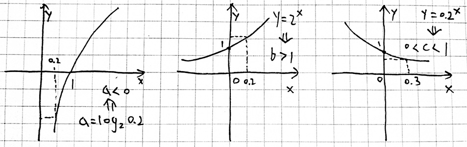

$\therefore a < 0 < c < 1 < b$

$\therefore a < c < b$

---

已知 $a=3^{0.2},b=\log_6 4,c=\log_3 2$ ，则a,b,c的大小关系为（   ）

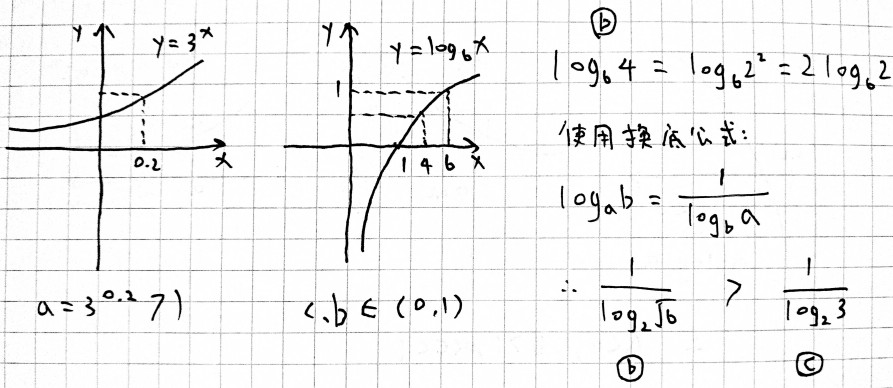

$\therefore c < b < a$

---

（2019·海南）已知f(x)是奇函数，且当x<0时， $f(x)=-e^{ax}$ . 若 $f(\ln 2)=8$ ，则a=__.

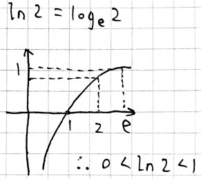

$\because f(x)=-f(-x)$

$\therefore f(\ln 2)=-f(-\ln 2)=8$

$\therefore f(-\ln 2)=-8=-e^{a\cdot (-\ln 2)}$

$\therefore e^{-a\ln 2}=8$

$\therefore \log_e 8=\ln 2^{3}=3\ln 2=-a\ln 2$

$\therefore a=-3$

---

（2019·新课标III）函数 $y=\frac{2x^3}{2^x+2^{-x}}$ 在[-6,6]的图像大致为（   ）

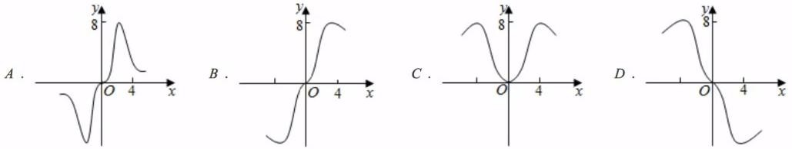

*先分析奇偶性，排除选项C：*

$f(-x)=\frac{2\cdot(-x)^3}{2^{-x}+2^x}=-f(x)$

*排除D：*

设x=2，y>0

*排除A：*

$f(4)=\frac{128}{16+\frac{1}{16}}\approx 7$