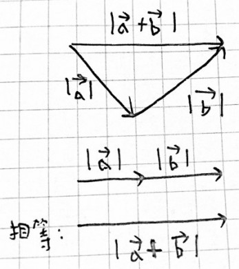
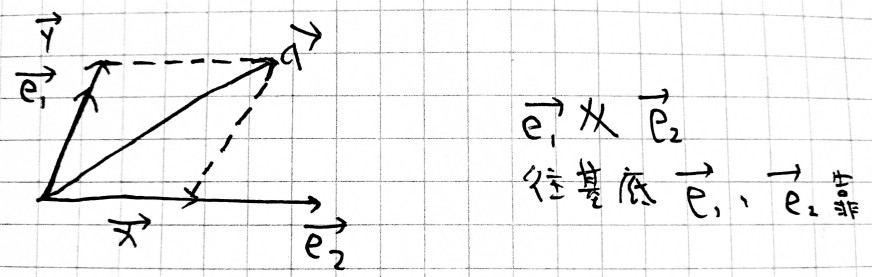
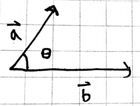
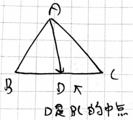
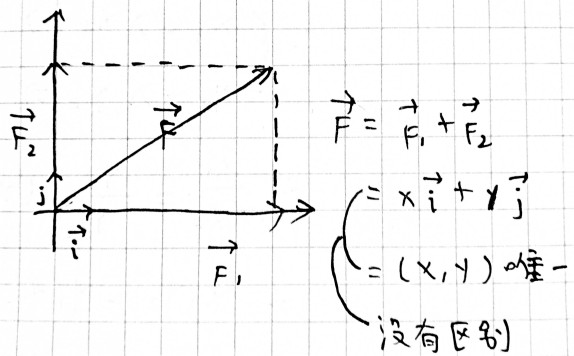
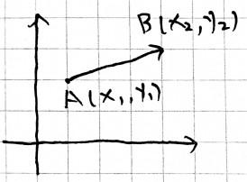
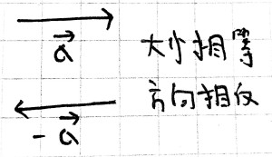
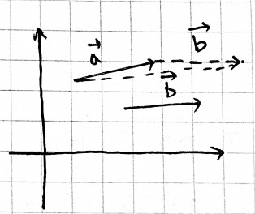
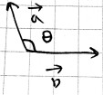
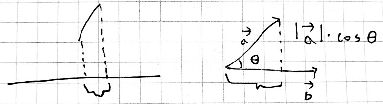

当前所在位置：<strong>run > 高中 > 数学</strong>

# 向量

## 概念

| 量           | 包含       |
| ------------ | ---------- |
| 向量（矢量） | 大小、方向 |
| 数量（标量） | 大小       |

$|\vec{AB}|$ 表示从A点到B点的长度，称向量的模，“||”**不是绝对值**符号！

* 当模为0时，我们称为零向量，写为 $\vec{0}$
* 当模为1时，我们称为单位向量
* 模长公式为 $|\vec{b}|=\sqrt{x^2 +y^2}$

---

* 向量相等：大小相等、方向相同
* 向量平行=共线：方向相同/不同
* 零向量有方向，且与任何向量平行

---

$\vec{a}^2=\vec{a}\cdot\vec{a}=|\vec{a}|\cdot|\vec{a}|\cdot\cos 0=|\vec{a}|^2$

用法示例：

$|3\vec{a}+4\vec{b}|$

* 使用平方公式： $\sqrt{|3\vec{a}+4\vec{b}|^2}=\sqrt{(3\vec{a}+4\vec{b})^2}$
* 使用坐标： $\vec{a}=(1,2),\vec{b}=(4,5)$
  * $3\vec{a}+4\vec{b}=3(1,2)+4(4,5)=(19,26)$
    $\Longrightarrow |3\vec{a}+4\vec{b}|=\sqrt{19^2+26^2}$

## 不等式

$|\vec{a}+\vec{b}|\leq|\vec{a}|+|\vec{b}|$

## 基本定理

若 $\vec{e}_1$ ， $\vec{e}_2$ 不共线，则对于任一 $\vec{a}$ ，有且只有一组 $\lambda_1$ 、 $\lambda_2$ ，使 $\vec{a}=\lambda_1 \vec{e}_1+\lambda_2\vec{e}_2$ 。

$$
\begin{aligned}
& \vec{x}=\lambda_2 \vec{e}_2, \lambda_2 \in R \\
& \vec{y}=\lambda_1 \vec{e}_1, \lambda_1 \in R
\end{aligned}
$$

$\therefore\vec{a}=\lambda_1 \vec{e}_1+\lambda_2 \vec{e}_2, \lambda_1, \lambda_2 \in R$

---

* $\theta \in [0^{\circ},180^{\circ}]$
  * $\theta=0^{\circ},\vec{a},\vec{b}$ 同向
  * $\theta=90^{\circ},\vec{a}\perp\vec{b}$
  * $\theta=180^{\circ},\vec{a},\vec{b}$ 反向

---

### 三角形的中线定理运用

证： $\vec{AD}=\frac{1}{2}(\vec{AB}+\vec{AC})$

$\because\vec{AD}=\vec{AB}+\vec{BD}$

$\because\vec{AD}=\vec{AC}+\vec{CD}$

$\therefore 2\vec{AD}=\vec{AB}+\vec{AC}+\underline{\vec{BD}+\vec{CD}}$

（大小相等，方向相反 => 0）

$\therefore 2\vec{AD}=\vec{AB}+\vec{AC}$

$\therefore \vec{AD}=\frac{1}{2}(\vec{AB}+\vec{AC})$

---

### 正交分解与坐标表示

---

点坐标表示：A(1,3)

向量坐标表示： $\vec{a}=(1,3)$ 带等号

---

$\vec{AB}=(x_2 -x_1,y_2 -y_1)$

## 四则运算

### 加减法运算

> 加法交换律、结合律同样适用

**方向不同**：

* 三角形法则： $\vec{AB}+\vec{BC}=\vec{AC}$
* 平行四边形法则： $\vec{a}+\vec{b}'$

---

**方向相同/相反**：

* $\vec{a}$ 和 $\vec{b}$ 方向相同，则 $\vec{a}+\vec{b}$
* $\vec{a}$ 和 $\vec{b}$ 方向相反，则 $\vec{a}-\vec{b}$

* 减法： $\vec{a}-\vec{b}$ 看成 $\vec{a}+(-\vec{b})$

### 数乘运算

> 可用乘法结合律、分配律，不能使用结合律 $(\vec{a}\cdot\vec{b})\vec{c}\neq\vec{a}(\vec{b}\cdot\vec{c})$
>

$\lambda \vec{a}(\lambda\in R)$

* 长度： $|\lambda|\cdot |\vec{a}|$
* 方向：
  * $\lambda > 0$ 时，同向
  * $\lambda = 0$ 时， $\lambda \vec{a}=0\cdot \vec{a}=\vec{0}$
  * $\lambda < 0$ 时，反向
* 若 $\vec{b}//\vec{a}$ ，则 $\exists\lambda \in R$ ，使 $\vec{b}=\lambda \vec{a}$
* $\exists\lambda \in R$ ，使 $\vec{b}=\lambda \vec{a}$ ，则 $\vec{b}//\vec{a}$

### 坐标运算

$\vec{a}=(x_1 ,y_1)=x_1 \cdot \vec{i} + y_1 \cdot \vec{j}$

$\vec{b}=(x_2 ,y_2)=x_2 \cdot \vec{i} + y_2 \cdot \vec{j}$

$\vec{a}+\vec{b}=(x_1 +x_2, y_1 +y_2)$

$\vec{a}-\vec{b}=(x_1 -x_2, y_1 -y_2)$

$\lambda \vec{a}=\lambda (x_1 ,y_1)=(\lambda x_1 ,\lambda y_1)$ ， $\vec{a} \neq \vec{0}$

## 平行

$\vec{a}//\vec{b}$

* 则 $\exists \lambda \in R$ ，使 $\vec{a}=\lambda\vec{b}$
* 则 $\exists \lambda \in R$ ，使 $(x_1 ,y_1)=\lambda (x_2 ,y_2)(\lambda x_2 ,\lambda y_2)$

$$
\therefore\begin{cases}
x_1 = \lambda x_2 \Longrightarrow \frac{x_1}{x_2}=\lambda \\
y_1 = \lambda y_2 \Longrightarrow \frac{y_1}{y_2}=\lambda
\end{cases}
$$

$\therefore \frac{x_1}{x_2}=\frac{y_1}{y_2}(x_2 ,y_2 \neq 0)$

$\therefore x_1 y_2 =y_1x_2\Longrightarrow x_1 y_2-y_1 x_2=0$

## 数量积

$\vec{a}\cdot\vec{b}=\underline{|\vec{a}|\cdot |\vec{b}|\cdot \cos \theta},\theta\in[0,\pi]$

注：向量相乘的值是数量，相当于反映做功的多少

## 投影

可用分配律：

* $\vec{a}\cdot(\vec{b}+\vec{c})=\vec{a}\cdot\vec{b}+\vec{a}\cdot\vec{c}$
* $\vec{a}\cdot\vec{b}=\vec{b}\cdot\vec{a}$

**两边不能除以向量**：

* $(\vec{a}\cdot\vec{b})\cdot\vec{c}\neq\vec{a}\cdot(\vec{b}\cdot\vec{c})$
* $\vec{a}\cdot\vec{b}=\vec{a}\cdot\vec{c}\Longrightarrow\vec{b}\neq\vec{c}$

## 垂直

$\vec{a}\perp\vec{b}\Leftrightarrow\vec{a}\cdot\vec{b}=0,(\vec{a},\vec{b}\neq 0)$

$\vec{a}=(x_1 ,y_1)$
$\vec{b}=(x_2 ,y_2)$

$\vec{a}\cdot\vec{b}=x_1 x_2+y_1 y_2$