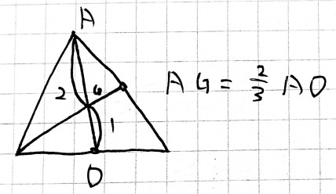
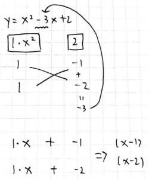

当前所在位置：<strong>run > 高中 > 数学</strong>

# 基本数学方法

## 几何

三角形的重心：三条中线的交点

## 快捷计算

> 根号

$x^2=3,x=\pm \sqrt{3}$

> 分子分母都为分数

$\frac{\frac{5}{28}}{\frac{5}{7}}$ 可通过将分子分母都乘以 $\frac{7}{5}$ 来得到答案

> 十字相乘法

$y=ax^2+bx+c$ （a、b、c为整数）

* $x^2$ 的系数：由哪2个整数相乘得到？
* 常数项c的系数：由哪2个整数相乘得到？

## 公式

> 函数公式

* 求根公式： $x=\frac{-b\pm\sqrt{\Delta}}{2a}$

> 乘法公式

* 平方差： $a^2-b^2=(a-b)(a+b)$
* 完全平方： $(a\pm b)^2=a^2\pm 2ab + b^2$
* 和立方： $(a+b)^3=a^3+3a^2b+3ab^2+b^3$ （a的降次，b的升次，系数靠杨辉三角）
* 差立方： $(a-b)^3=a^3-3a^2b+3ab^2-b^3$ （第一个永远是+号，交错写正负号）
* 立方差： $a^3-b^3=(a-b)(a^2+ab+b^2)$
* 立方和： $a^3+b^3=(a+b)(a^2-ab+b^2)$

## 成双成对

* $\lambda$ 、 $\mu$
* $a$ 、 $b$
* $x$ 、 $y$
* $i$ 、 $j$