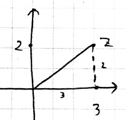

当前所在位置：<strong>run > 高中</strong>

# 复数

## 概念

假设负数可以开根？

规定 $\sqrt{-1}=i$ ，则 $i^2=-1$

---

**分类拓展至复数集C**

* 实数集R
* 虚数集z=a+bi（a,b∈R,b≠0）（a是实部、b是虚部、i叫做虚数单位）
  * 纯虚数a=0，b≠0
  

---

**复平面**

Z=2+3i，则坐标为(2,3)

画出原点到z的一条线，可以看作复数的模（|z|）

* 复数的模长公式为 $|z|=|a+bi|=\sqrt{a^2+b^2}$
  * $|z|=\sqrt{3^2+2^2}=\sqrt{13}$

* 判断两个复数相等：它们的坐标是否相等

---

**复数的四则运算**

* 加减：假设把i换成x，直接按照实数的方法运算即可
* 乘： $(1+2i)(3+4i)$ ，直接把i看成x，按照实数的方法运算，遇到 $i^2$ 变成-1
  * 完全平方、平方差公式都可用

* 实部相等，虚部相反互为共轭复数（ $z_1=a+bi$ 和 $z_2=a-bi$ ）
* 复数化简就是把它变为复数的基本形式z=a+bi

---

**小结论**

1. 设 $z_1$ ， $z_2$ 为两个复数，则 $|z_1z_2|=|z_1|\cdot |z_2|$ ， $|\frac{z_1}{z_2}|=\frac{|z_1|}{|z_2|}$
2. 设 $k\in N$ ，则 $i^{4k} = 1$ ， $i^{4k+1} = i$ ， $i^{4k+2} = -1$ ， $i^{4k+3} = -i$