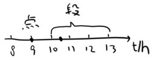

当前所在位置：<strong>run > 高中 > 物理</strong>

# 物理量基础

* 质点：只有**质量和位置**，没有体积和大小的理想模型。

* 参考系：为了研究物体运动（参照物+坐标系）。
  * 任意性：所有物体
  * 标准性：物体假定不动
  * 差异性：不同参考系观察结果可能不同
  
* 时刻：一个瞬间

* 时间：一段时间间隔

  

  * 第n秒(内)：0-1第一秒；2-3第三秒
  * 第n秒初/末：2第三秒初；3第三秒末
  * 前n秒：0-2前2秒

* 位移x≤路程s（单向直线运动时，位移**的大小**=路程）

* 标量：路程

* 矢量（向量）：位移，“+-”表示方向，比大小用绝对值

---

**匀速直线运动**

* 平均速度（有方向）： $\bar{v} = \frac{\Delta x}{\Delta t}$ （位移/时间）
* 平均速率（无方向）： $\bar{v} = \frac{s}{t}$ （路程/时间）
* 瞬时速度：时间无限接近于0，方向为轨迹切线方向

**加速度**

变化量（Δ）：末-初

所以，速度的变化量： $\Delta v=v_t - v_0$

加速度 $a=\frac{\Delta v}{t}$ （单位 $\frac{m/s}{s}=m/s^2$ ）

加速度方向与Δv方向一定相同

---

**匀变速直线运动**：a不变的直线运动

加减速，看a和v的正负号，同号加速、异号减速